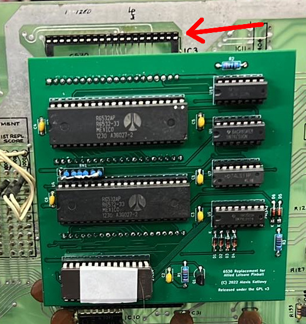

6530 Replacement
================
Replaces the 6530 ICs found on early revision Allied Leisure pinball machines.

Components
----------
Please note these designs and instructions come with absolutely no warranty, implied or otherwise. I write these instructions assuming the builder has experience in assembling electronics.

You will need:
 - x1 27C64 EPROM (or equivalent)
 - x1 28 pin DIP IC socket
 - x2 6532 IC's
 - x5 40 pin IC socket - Dual wipe, **not machined**
 - x1 74LS42 DIP IC
 - x1 16 pin DIP IC socket
 - x1 74LS11 DIP IC
 - x2 74LS00 DIP IC
 - x3 14 pin DIP IC socket
 - x6 1N4148 silicon diodes
 - x1 2N7000 transistor
 - x3 1k ohm 1/4W resistors
 - x1 1k x6 resistor network (or alternatively an additional 6 1k ohm 1/4W resistors)
 - x6 100nF 50V monolithic capacitors
 - x100 pin headers to fit the original sockets on the CPU board (5 rows of 20 pins)
 - Alternatively: x5 stackable headers for the ESP32 [Sparkfun part number PRT-14311](https://www.sparkfun.com/esp32-thing-stackable-header-set.html). These won't damage IC sockets. See *Construction Notes* below.

To have these boards manufactured, it should be as simple as zipping the 6530-Replacement-Gerber folder and submitting them to a PCB manufacturer. The board dimensions are 100.3 x 100.3mm

ROMs
----
I can not host the ROM image here as they are copyrighted. I have supplied a 1k blank image to assist with generating the required ROM image.

There are three ROM images I was supplied with, one each from the three original 6530's:
 - EE1712_82219_DG_MOS6530_009.bin
 - EE1712_82219_DG_MOS6530_010.bin
 - EE1712_82219_DG_MOS6530_011.bin

To generate a ROM image for the board on Linux or Mac in the terminal:
`cat Blank1k.bin Blank1k.bin Blank1k.bin EE1712_82219_DG_MOS6530_009.bin Blank1k.bin EE1712_82219_DG_MOS6530_010.bin EE1712_82219_DG_MOS6530_011.bin Blank1k.bin > AdaptorROM.bin`

And on the Windows command prompt:
`copy /b Blank1k.bin+Blank1k.bin+Blank1k.bin+EE1712_82219_DG_MOS6530_009.bin+Blank1k.bin+EE1712_82219_DG_MOS6530_010.bin+EE1712_82219_DG_MOS6530_011.bin+Blank1k.bin AdaptorROM.bin`

You will first need to `cd` to the directory the ROMs are in. This will give you an 8kB ROM image ready to burn to a 27C64 or equivalent EPROM.

Construction notes
------------------
I recommend first replacing, at minimum, the three original 6530 IC sockets on the main board with dual wipe sockets. **Do not use machined sockets.** Ideally, all sockets should be replaced.

The headers need to be installed **before the 6530 IC sockets on the Replacement board are installed**.

If you are using ESP32 stackable headers, they won't damage the IC sockets on the main board, however they are more complicated to solder. Install all headers in the board from the component side, then flip the board so the black housings of the headers are on a flat surface. They will align themselves vertically. They can now be soldered. It will be easier if each header has one pin soldered first to keep it from moving.

When the pins are soldered, the black housing of the headers can be removed with a small pair of pliers. Once the housing starts to move it will release easily. The pins remaining **where the housing was removed** can be cut off. You should be left with the pins **on the solder side of the board**.

If you are using regular pin headers, they will tend to damage the IC sockets on the main board. I recommend replacing the original sockets with new **dual wipe** sockets. **Do not use machined IC sockets**. They need to be installed from the solder side of the board and soldered on the component side. **Make sure the pins are aligned vertically**. Solder one pin in place, then melt the solder again while aligning the header. The header won't move after the solder has cooled.

Construction from then on should be straight forward, following the usual rules.

If you are using a resistor network for RN1, the dot needs to align with the square pad.

Installation
------------
Installing the board has several issues which need to be considered. The main one is confusion over how it plugs into the sockets on the main board. **The top row of the IC3 socket - pins 21 through 40 - should not connect to anything.** All other pins should line up with the sockets. Check and re-check alignment before inserting the board.

Good luck!
